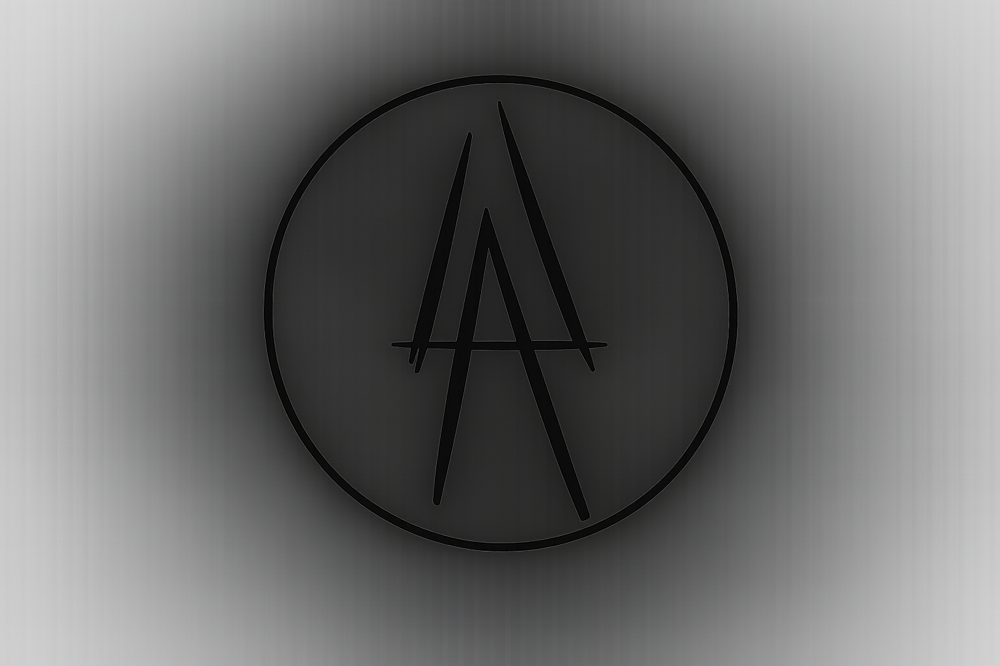

# UastasiProject

---

# GUIDA TECNICA — REGISTRAZIONE DOMINI

## B Leader — Sistema di Prenotazione Auto di Lusso

**Versione 1.0.0 — Release Ufficiale · 13 Luglio 2026**

---

*UastasiProject · Página 1*

---

# UastasiProject

---

## Indice dei Contenuti

1. 📌 Premessa .................................................................................. 3
2. 1️⃣ Creare un Account su Dynadot ................................................. 4
3. 2️⃣ Registrare `bleaderitaly.com` ................................................... 5
4. 3️⃣ Registrare `bleaderitaly.it` ....................................................... 6
5. 4️⃣ Riepilogo: Cosa Avrete alla Fine ............................................. 8
6. 5️⃣ Checklist — Informazioni per il Deploy .................................... 9
7. 6️⃣ Domande Frequenti (FAQ) ....................................................... 10
8. 📞 Supporto ................................................................................... 11

---

*UastasiProject · Página 2*

---

# UastasiProject

---

## 1. 📌 Premessa

Per rendere operativo il sito web **"B Leader"** — il vostro sistema di prenotazione auto di lusso — abbiamo bisogno di due domini internet:

| Dominio | Scopo | Prezzo (primo anno) |
|---|---|---|
| **bleaderitaly.com** | Dominio principale internazionale | ~$11.08 |
| **bleaderitaly.it** | Dominio locale per il mercato italiano | ~$5.69 |
| **Totale** | | **~$19.77** più o meno |

Entrambi i domini sono **attualmente disponibili**. Vi consigliamo di registrarli **subito** su **Dynadot** (www.dynadot.com), uno dei registrar più economici e affidabili, che supporta nativamente sia i domini `.com` che `.it`.

Questa guida vi accompagnerà passo passo.

| Campo | Valore |
|---|---|
| **Nome in Codice del Progetto** | B Leader |
| **Mercato di Riferimento** | Italia (IT) + Stati Uniti (USA) |
| **Preparato da** | UastasiProject Team — in collaborazione con Gabriele (sviluppo tecnico) |
| **Stack Tecnologico** | Next.js + TypeScript + Cloudflare Pages |
| **Conformità Dati** | GDPR (UE 2016/679), Codice della Privacy Italiano (D.Lgs. 196/2003) |

---

*UastasiProject · Página 3*

---

# UastasiProject

---

## 2. 1️⃣ Creare un Account su Dynadot

### 1. Andate sul sito
Aprite il browser e navigate su: **https://www.dynadot.com**

### 2. Cliccate su "Sign In" (in alto a destra)
Si aprirà un pannello. Cliccate su **"Create Account"**.

### 3. Compilate il modulo con i vostri dati

| Campo | Cosa inserire |
|---|---|
| **Username** | Scegliete un nome utente (es. `bleader`) |
| **Password** | Create una password sicura (almeno 8 caratteri, con numeri e simboli) |
| **First Name** | Il vostro nome |
| **Last Name** | Il vostro cognome |
| **Email** | La vostra email principale |
| **Phone** | Il vostro numero di telefono |
| **Address, City, State, ZIP, Country** | Il vostro indirizzo completo (Italia) |

> ⚠️ **Importante**: I dati inseriti devono essere **reali e corrispondere a un documento d'identità valido**. Questo è obbligatorio, specialmente per il dominio `.it`.

### 4. Verificate l'email
Riceverete una mail di conferma. Cliccate sul link per attivare l'account.

---

*UastasiProject · Página 4*

---

# UastasiProject

---

## 3. 2️⃣ Registrare `bleaderitaly.com`

### 1. Cercate il dominio
Dalla homepage di Dynadot, digitate `bleaderitaly.com` nella barra di ricerca e premete **Search**.

### 2. Aggiungetelo al carrello
Apparirà il risultato con scritto **"Available"**. Cliccate sull'icona del carrello 🛒.

### 3. Verificate il carrello
- **Dominio**: `bleaderitaly.com`
- **Periodo**: 1 anno (potete anche scegliere 2 o più anni)
- **WHOIS Privacy**: ✅ **Già incluso gratuitamente** — il vostro nome e indirizzo non saranno visibili pubblicamente

### 4. Andate al Checkout
Cliccate **"Checkout"** e completate il pagamento con:
- **Carta di credito/debito** (Visa, Mastercard, American Express, ecc.)
- **PayPal**

### 5. Conferma
Riceverete una email con oggetto **"Order Finished"**. Il dominio è vostro! 🎉

### 6. Verifica WHOIS (IMPORTANTE!)
Entro **15 giorni** dovrete verificare i vostri dati di contatto:
- Controllate la vostra email per un messaggio da Dynadot o ICANN con oggetto simile a "Verify your contact information"
- Cliccate sul link di verifica
- ⚠️ **Se non lo fate entro 15 giorni, il dominio verrà sospeso.** (Se siete impegnati, posso ricordarvelo io.)

---

*UastasiProject · Página 5*

---

# UastasiProject

---

## 4. 3️⃣ Registrare `bleaderitaly.it`

Il dominio `.it` richiede qualche attenzione in più perché è regolato dal **Registro .it** (IIT-CNR di Pisa).

### Requisiti per registrare un `.it`

Potete registrare un `.it` se rientrate in **almeno una** di queste categorie:

- ✅ Cittadino italiano (anche se residente all'estero)
- ✅ Cittadino di un paese UE/SEE con residenza in UE/SEE
- ✅ Azienda con sede legale in Italia o UE/SEE
- ✅ Persona fisica residente in Italia o UE/SEE

> 💡 **Nel vostro caso**, essendo un cliente italiano, non ci sono problemi: potete registrarlo con il vostro **Codice Fiscale** (persona fisica) o **Partita IVA** (azienda).

### Procedura

### 1. Cercate il dominio
Come per il `.com`, digitate `bleaderitaly.it` nella barra di ricerca di Dynadot e premete **Search**.

### 2. Aggiungetelo al carrello
Cliccate sull'icona del carrello 🛒.

### 3. Completate il checkout
Procedete al pagamento come fatto per il `.com`.

---

*UastasiProject · Página 6*

---

# UastasiProject

---

### 4. Dati aggiuntivi per il `.it`
Durante o dopo la registrazione, Dynadot vi chiederà (o vi invierà una email per raccogliere):

| Dato Richiesto | Dettaglio |
|---|---|
| **Codice Fiscale** (16 caratteri) | Se registrate come persona fisica |
| **Partita IVA** (11 cifre) | Se registrate come azienda |
| **Indirizzo completo in Italia o UE** | Incluso CAP (5 cifre) e provincia (2 lettere, es. `MI`, `RM`) |
| **Nazionalità** | Italiana |

> ⚠️ Il Registro `.it` verifica questi dati. Eventuali incongruenze possono causare la revoca del dominio.

### 5. Verifica nameserver (automatico)
Dynadot assegnerà automaticamente dei nameserver provvisori. Non preoccupatevi: li cambieremo noi in fase di deploy.

---

*UastasiProject · Página 7*

---

# UastasiProject

---

## 5. 4️⃣ Riepilogo: Cosa Avrete alla Fine

Dopo aver completato entrambi gli acquisti, avrete:

| # | Elemento | Stato |
|---|---|---|
| 1 | Account Dynadot attivo con la vostra email e password | ✅ |
| 2 | Dominio `bleaderitaly.com` registrato e verificato | ✅ |
| 3 | Dominio `bleaderitaly.it` registrato con i vostri dati fiscali italiani | ✅ |
| 4 | WHOIS Privacy attivo su entrambi (i vostri dati personali non sono visibili al pubblico) | ✅ |
| 5 | Costo totale: circa **$16.77** (~15€) per il primo anno | 💰 |

---

*UastasiProject · Página 8*

---

# UastasiProject

---

## 6. 5️⃣ Checklist — Informazioni da Inviarci per il Deploy

Una volta registrati i domini, abbiamo bisogno di queste informazioni per mettere online il sito:

| # | Informazione | Dettaglio |
|---|---|---|
| 1 | **Email dell'account Dynadot** | L'indirizzo email con cui avete creato l'account |
| 2 | **Conferma di aver verificato entrambi i domini** | Avete cliccato sui link di verifica WHOIS? (Sì/No) |
| 3 | **Conferma che non esistono già caselle email su questi domini** | Esiste già `info@bleaderitaly.com` o simili? Se sì, con quale provider? |
| 4 | **Email professionale: ne volete una?** | Es. `info@bleaderitaly.com`. Se sì, possiamo configurarvela con Google Workspace o altro provider. |

---

*UastasiProject · Página 9*

---

# UastasiProject

---

## 7. 6️⃣ Domande Frequenti (FAQ)

**D: Devo darvi la password del mio account Dynadot?**
No. Useremo il sistema di **Sub-Account** di Dynadot: voi ci inviterete come collaboratori con accesso limitato solo alla gestione DNS. La vostra password e i dati di pagamento rimangono privati.

**D: Quanto tempo ci vuole per il deploy?**
Una volta ricevute le informazioni, possiamo completare la configurazione DNS su Cloudflare e il deploy in circa **30-60 minuti**. La propagazione DNS completa può richiedere fino a 48 ore, ma solitamente è molto più rapida (pochi minuti o qualche ora).

**D: Cosa succede se non registro subito i domini?**
Qualcun altro potrebbe registrarli prima di voi. I domini sono attualmente disponibili, ma è questione di tempo. Vi consigliamo di procedere oggi stesso.

**D: Devo rinnovare i domini ogni anno?**
Sì. Potete attivare l'**auto-renew** (rinnovo automatico) su Dynadot per non dimenticarvene. Ve lo consigliamo caldamente.

**D: Chi è il proprietario legale dei domini?**
Voi. I domini sono intestati a voi (o alla vostra azienda) con i vostri dati anagrafici/fiscali. Noi ci occuperemo solo della configurazione tecnica.

---

*UastasiProject · Página 10*

---

# UastasiProject

---

## 8. 📞 Supporto

Per qualsiasi dubbio durante la procedura di registrazione, potete contare su:

| Canale | Dettaglio |
|---|---|
| **Supporto Dynadot** | https://www.dynadot.com/help (in inglese) |
| **Guide ufficiali Dynadot** | https://www.dynadot.com/community/blog/ |
| **Noi (UastasiProject)** | Rispondete a questa comunicazione per qualsiasi domanda o chiarimento |

---

*Documento preparato da UastasiProject per il cliente B Leader — 13 Luglio 2026*

*UastasiProject · Página 11*
